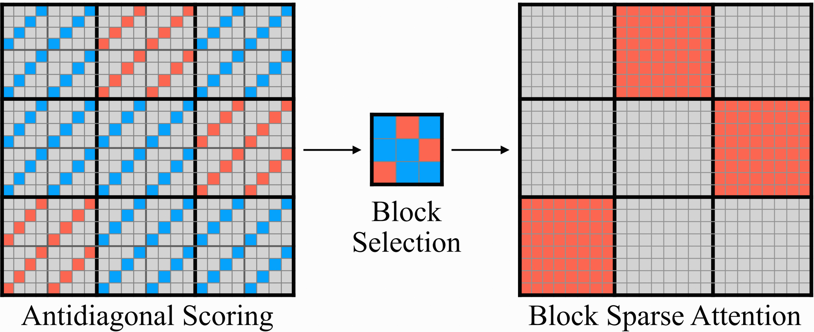
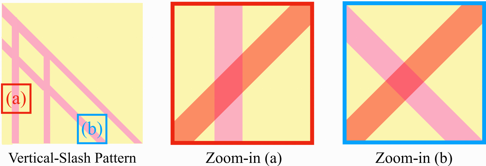
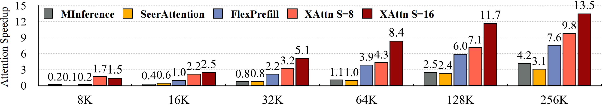
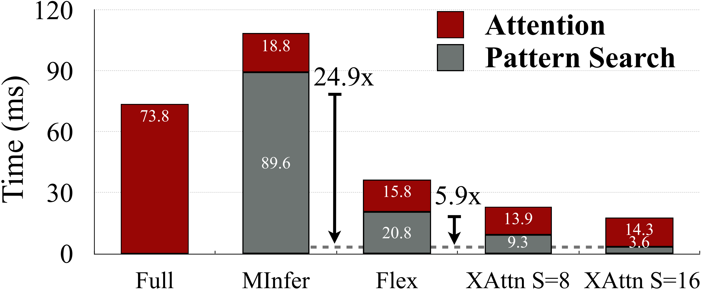

# XAttention: Block Sparse Attention with Antidiagonal Scoring

<p align="center">
    <a href="https://arxiv.org/abs/2503.16428"><b>Paper</b></a> |
    <a href="figures/Xattention.pdf"><b>Slides</b></a>
</p>

## 🧠 TL;DR
XAttention is a plug-and-play sparse attention framework for Transformers that speeds up long-context inference by up to 13.5× — without sacrificing accuracy.
It introduces a lightweight metric based on antidiagonal sums to efficiently select important attention blocks, enabling high sparsity and fast computation.

## ✨ Demo

### 🎬 Video Generation · 🧠 Video Understanding · 📚 Long Sequences 

Check out what Xattention is capable of!

https://github.com/user-attachments/assets/5c43d39e-bb91-4797-8ae2-050bea1bbc5f


### ✨ Let’s reveal the magic behind the Xattention algorithm!

https://github.com/user-attachments/assets/9203d744-d00a-40c1-acd6-ec047bb2beac


## Abstract
Long-Context Transformer Models (LCTMs) are vital for real-world applications but suffer high computational costs due to attention’s quadratic complexity. 
Block-sparse attention mitigates this by focusing computation on critical regions, yet existing methods struggle with balancing accuracy and efficiency due to costly block importance measurements. 
In this paper, we introduce XAttention, a plug-and-play framework that dramatically accelerates long-context inference in Transformers models using sparse attention. XAttention’s key innovation is the insight that the sum of antidiagonal values (i.e., from the lower-left to upper-right) in the attention matrix provides a powerful proxy for block importance. This allows for precise identification and pruning of non-essential blocks, resulting in high sparsity and dramatically accelerated inference. 
Across comprehensive evaluations on demanding long-context benchmarks—including RULER and LongBench for language, VideoMME for video understanding, and VBench for video generation—XAttention achieves accuracy comparable to full attention while delivering substantial computational gains. 
We demonstrate up to 13.5× acceleration in attention computation. These results underscore XAttention’s ability to unlock the practical potential of block sparse attention, paving the way for scalable and efficient deployment of LCTMs in real-world applications.

<p align="center">
  
  
</p>

## Installation and Usage

###  Xattention Environment

```bash
conda create -yn xattn python=3.10
conda activate xattn

conda install -y git
conda install -y nvidia/label/cuda-12.4.0::cuda-toolkit
conda install -y nvidia::cuda-cudart-dev
conda install -y pytorch torchvision torchaudio pytorch-cuda=12.4 -c pytorch -c nvidia

pip install transformers==4.46 accelerate sentencepiece minference datasets wandb zstandard matplotlib huggingface_hub==0.23.2 torch torchaudio torchvision xformers  vllm==0.6.3.post1 vllm-flash-attn==2.6.1
pip install tensor_parallel==2.0.0

pip install ninja packaging
pip install flash-attn==2.6.3 --no-build-isolation
pip install flashinfer -i https://flashinfer.ai/whl/cu121/torch2.4/

# LongBench evaluation
pip install seaborn rouge_score einops pandas


# Install xAttention
pip install -e .

# Install Block Sparse Streaming Attention
git clone https://github.com/mit-han-lab/Block-Sparse-Attention.git
cd Block-Sparse-Attention
python setup.py install
cd ..

export PYTHONPATH="$PYTHONPATH:$(pwd)"

```

###  Quick Use
```python 
import torch
from xattn.src.Xattention import Xattention_prefill

bsz = 1
heads = 32
seq_len = 1024
dim = 128
q = torch.randn((bsz,heads,seq_len,dim),dtype=torch.bfloat16).to("cuda")
k = torch.randn((bsz,heads,seq_len,dim),dtype=torch.bfloat16).to("cuda")
v = torch.randn((bsz,heads,seq_len,dim),dtype=torch.bfloat16).to("cuda")

attention_output = Xattention_prefill(query_states=q,key_states=k,value_states=v,stride=16,block_size=128,use_triton=True,chunk_size=2048)
attention_output
```
## Demo
After setting up the environment, you can run the following script to execute Xattention demo on the `gradientai/Llama-3-8B-Instruct-Gradient-1048k` model. The demo is designed to run on a single A100 GPU and supports a context length of up to 4.3 million tokens.

```bash
bash scripts/run_demo.sh
```

## Evaluation

### RULER
On the RULER benchmark, we apply strides of S = 8 and S = 16. You can reproduce the results from the paper with a simple one-liner of code.

Before run test, change model directory `$MODEL_DIR` defined in `eval/RULER/scripts/run.sh`
Look into eval/RULER for more information.

```bash
# Before run test, change model directory $MODEL_DIR defined in eval/RULER/scripts/run.sh
bash scripts/run_ruler.sh
```

### LongBench
Set up the required environment for Longbench, then reproduce Longbench's test results with a single line of code.
```bash
pip install fuzzywuzzy rouge
bash scripts/run_longbench.sh
```
### VLLM
We apply Stride S = 16 and threshold τ = 0.9 parameters on the QwenVL-2-7B model. XAttention achieves the best average score among current sparse attention methods and even outperforms FlashAttention on long videos, with a frame rate of 1 frame per second for up to 1 hour.

You can reproduce the Xattention and baselines results from the paper with a simple one-liner of code.
```bash
bash scripts/run_vllms.sh
```

### Hunyuan Video
For testing on HunyuanVideo, we used a threshold of 0.9 or 0.95 and a stride of 8. Reproduce the results by adjusting the parameters and running `scripts/run_hunyuan.sh`.
```bash
bash scripts/run_hunyuan.sh
```

## Efficiency
Figure below illustrates the prefill speedup of XAttention across token sequence lengths ranging from 8k to 256k. The attention breakdown over time indicates that the Xattention method effectively accelerates the pattern selection process.


<p align="center">
  
</p>


<p align="center">
  
</p>
You can reproduce the Xattention and baselines speedup results with a simple one-liner of code.

```bash
CUDA_VISIBLE_DEVICES=<device_idx> python eval/efficiecy/attention_speedup.py
```


## Citation

If you find Xattention useful or relevant to your project and research, please kindly cite our paper:

```bibtex
@article{xu2025xattention,
        title={XAttention: Block Sparse Attention with Antidiagonal Scoring},
        author={Xu, Ruyi and Xiao, Guangxuan and Huang, Haofeng and Guo, Junxian and Han, Song},
        journal={arXiv},
        year={2025}
}
```
